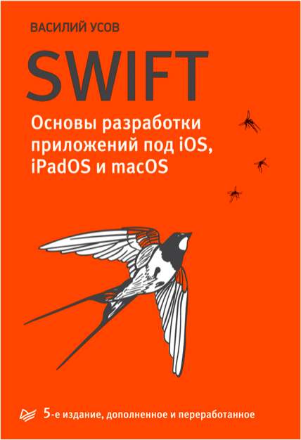

# Swift-Basics-Book1

This is about my learning Vasiliy Usov's book "Swift. Основы разработки приложений под iOS, iPadOS и macOS", 5th Edition

This book was my first step in iOS Developing and it's so usefull for beginners. There are learning Swift language and introduction to iOS and macOS developing.

Repo contains two directories: "syntax_learning" and "practice_projects". The first one contains sample code and examples from book lessons as well as solutions for homework tasks. The second one contains realization of projects which were demonstrated and suggested for implementation. 
