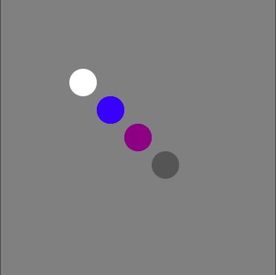
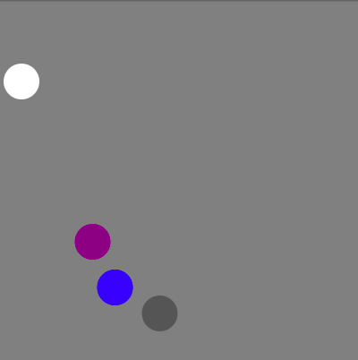

# Balls

This is a third project in a book.

In this project we created an interactive application in playground. We used Interactive Playground, UIKit and PlaygroundSupport libraries.

The essence of the game is as follows: there are several colored balls in a square box. The user can move the balls and collide them with each other, as well as with the borders of the box.

## Demonstration

Start of the game:

State after touch and collision of balls:

