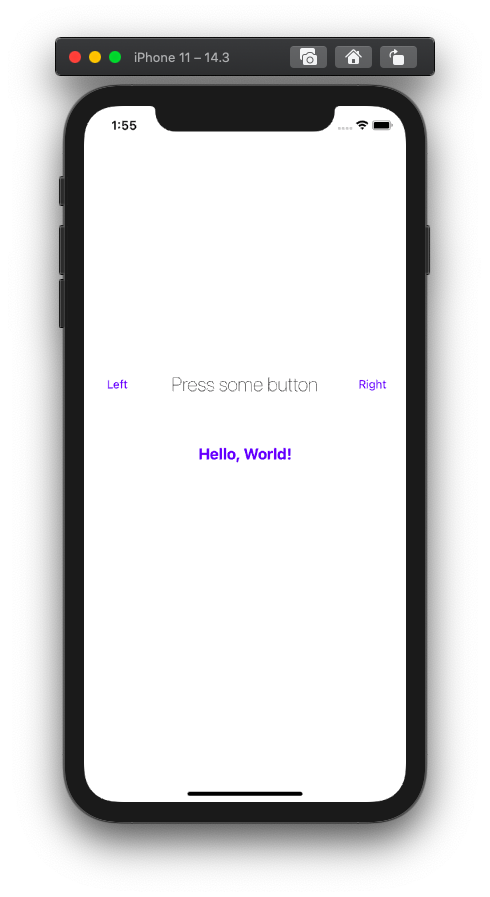
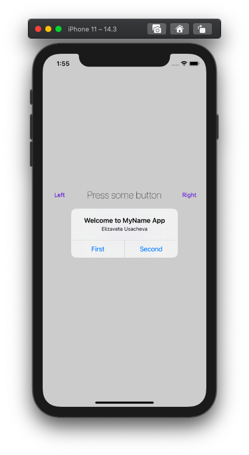
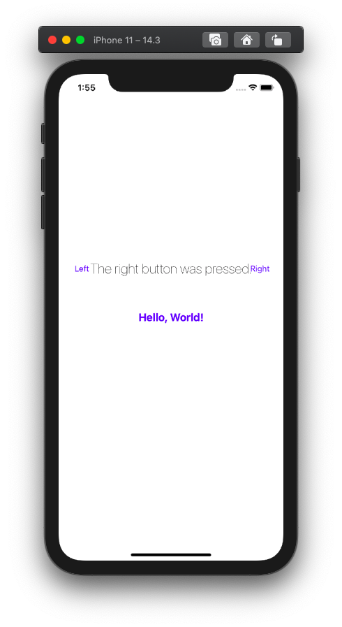

# MyName

This is a fourth project in a book.

In this project we created simple Single Page application. We used UIKit and storyboard for creating interface, learned Actions and Outlets for actions and access with buttons.

## Demonstration

Start page of application: "Left", "Right" and "Hello, World!" are buttons, "Press some button" is a label.

Showing Alert message with option buttons after pushing up "Hello, World!" button on the start screen.

After pushing up buttons "Left" and "Right" label change your text accordingly title of button.

