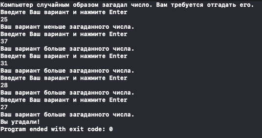

#  Guess the number

This is a second one project in a book. 

In this project we created a game "Guess the number" in which the user must guess a random number generated by the computer.

The essence of the game is as follows: the computer guesses an integer in the range from 1 to 50, and the player tries to guess it in the minimum number of moves. After each attempt, the application should report how the entered number compares with the hidden one: it is greater, less than or equal to it.

## Demonstration:

